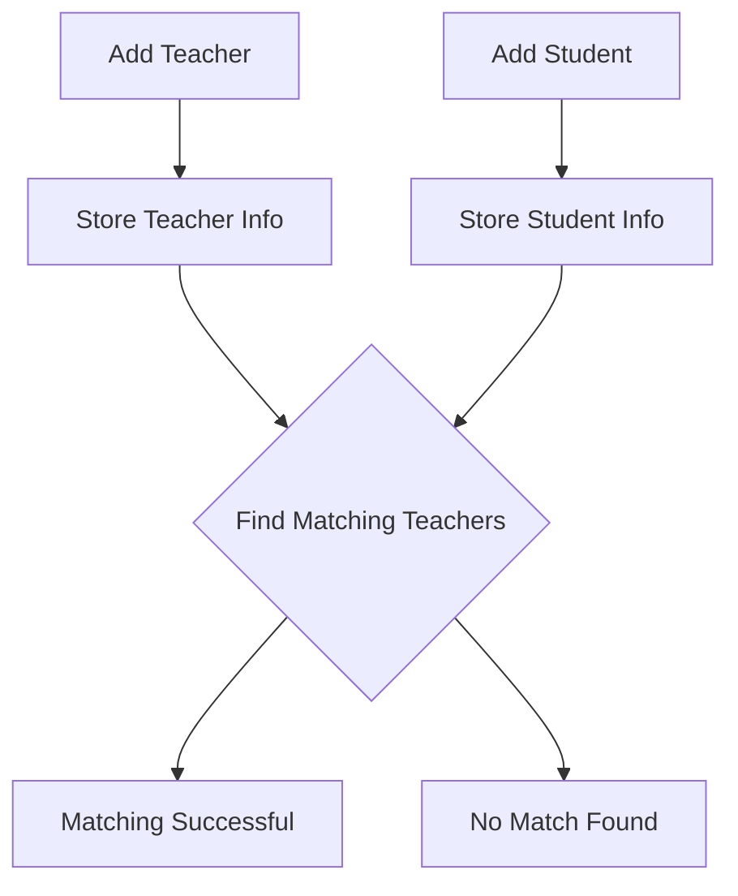

# Mentor_Matching_Project

## Vision

The Institute Matching System is designed to efficiently connect students with teachers based on matching skills within an educational institute. By leveraging blockchain technology, this smart contract provides a transparent, secure, and decentralized way to facilitate skill-based matching between students and teachers. This system empowers students to find the right teachers who can help them achieve their educational goals while allowing teachers to share their expertise with students who need it.

## Flowchart

1. **Add Teacher**: Teachers provide their details and skills.
2. **Add Student**: Students provide their details and required skills.
3. **Find Matching Teachers**: The system checks for skill matches between students and teachers.
4. **Matching Successful**: The system returns the addresses of matching teachers.
5. **No Match Found**: If no matching teachers are found, the system notifies the student.

## Contract Address

The smart contract is deployed on the Ethereum blockchain at the following address:

**Contract Address**: 0x52940fe5d7ee8076460e97d2a1e255ce70f0b917

## Future Scope

1. **Advanced Matching Algorithms**: Implement more sophisticated algorithms to match teachers and students based on multiple factors like experience, ratings, and availability.
2. **Student and Teacher Profiles**: Extend the contract to include detailed profiles with ratings, reviews, and a history of interactions.
3. **Payment Integration**: Integrate a payment system for students to compensate teachers directly through the platform.
4. **Decentralized Governance**: Implement a decentralized governance model where students and teachers can vote on platform updates and features.
5. **Cross-Institution Collaboration**: Allow multiple institutes to interact, share resources, and connect students with teachers across different platforms.

## Contact Information

For any questions, suggestions, or further information, please feel free to contact:

**Developer Name**: Abdul Basir
**Email**: genius01abdulbasir.9707@gmail.com
**GitHub**:  github.com/infinixuser009
**LinkedIn**: www.linkedin.com/in/abdul-basir-504393284

---

This README file provides a comprehensive overview of the Institute Matching System, detailing its vision, flowchart, contract information, future scope, and contact details. For deployment and usage instructions, please refer to the code comments and documentation.
